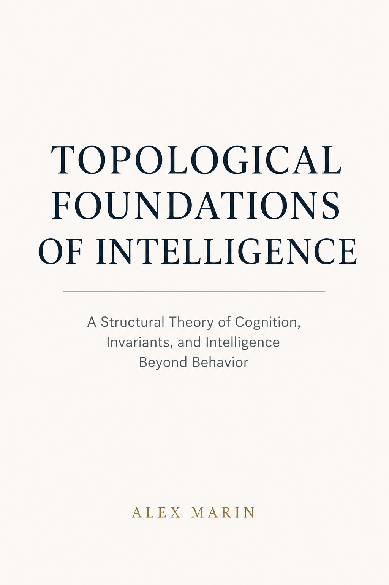
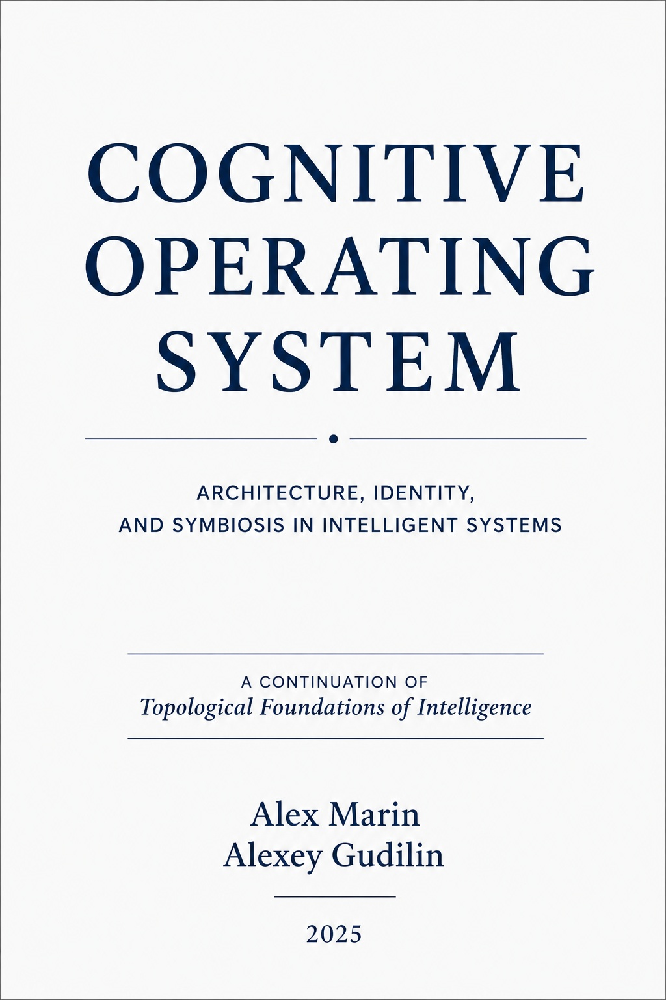
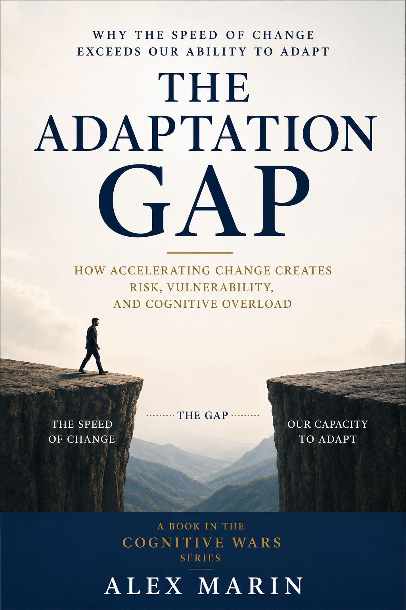

# alex-marin-books
The official Alex Marin book catalogue: published and forthcoming titles, descriptions, links, and supporting materials.
# Alex Marin — Books

A catalogue of published and forthcoming books by Alex Marin.

---

## Topological Foundations of Intelligence

### A Structural Theory of Cognition, Invariants, and Intelligence Beyond Behavior

*By Alex Marin and Alexey Gudilin · Kindle Edition*

*Topological Foundations of Intelligence* is an interdisciplinary work proposing a new way of understanding intelligence. The book approaches intelligence not as a collection of answers, processing speed, or observable behavior, but as a structure capable of preserving coherence, invariants, and integrity under changing states.

Drawing from topology, systems theory, cognitive science, and artificial intelligence, the book explores thinking as movement through a space of states, where not only outcomes matter, but also the trajectories of transformation. At the center of the work are questions of structural stability, constraints, feedback, adaptation, and identity preservation.

The book introduces a framework for reconsidering cognition, learning, human thought, and human–AI interaction from a structural perspective.

It is an attempt to build an architectural and structural theory of intelligence connecting philosophy, cognitive science, systems theory, and contemporary AI research.

[View on Amazon](https://www.amazon.com/dp/B0H31WLHWP)
---

## Cognitive Operating System

### Architecture, Identity, and Symbiosis in Intelligent Systems

*By Alex Marin and Alexey Gudilin · Kindle Edition*

*Cognitive Operating System* is the natural continuation of *Topological Foundations of Intelligence*.

While the first volume explored a fundamental question — what is intelligence as a structure? — this book takes the next step and asks: how can such a structure operate, evolve, and preserve its identity over time?

The book approaches intelligence not as a collection of functions or computational processes, but as an architecture capable of maintaining stability under continuous change. Central concepts include invariants, state spaces, self-reflection, the cognitive core, and the symbiotic relationship between humans and intelligent systems.

Rather than treating humans as users of technology, the author presents them as bearers of identity, responsibility, and structural continuity within an extended cognitive architecture. Artificial intelligence is viewed not as a replacement for human intelligence, but as a cognitive extension that expands capabilities while preserving the stability of the core.

This book is not a manual for building artificial intelligence and does not claim to be a completed scientific theory. Its purpose is to establish an architectural framework for future exploration of intelligence, cognitive systems, and human–AI symbiosis.

Together, *Topological Foundations of Intelligence* and *Cognitive Operating System* form the opening stage of a broader research program that continues through popular science articles, open GitHub repositories, mathematical formalization, and experimental investigation.

*For readers interested in artificial intelligence, cognitive science, cybernetics, systems thinking, and the future of human–machine collaboration.*

[View on Amazon](https://www.amazon.com/dp/B0H3MFX53L)
---

## The Mathematics of Thinking

### How Structure Makes Thinking Possible

*By Alex Marin and Alexey Gudilin · Kindle Edition*

**What happens between a question and an answer?**

Why can the same action result from understanding, habit, imitation, or chance? Why can an error sometimes reveal more about thinking than a correct result? And what must be preserved for intelligence to learn, adapt, and revise its own decisions without losing coherence?

*The Mathematics of Thinking* presents thinking not as a collection of isolated operations or as computation alone, but as organized movement through a space of possible states.

Within this space, some transitions are immediately available, others require intermediate steps, some are blocked by constraints, and some do not yet exist for the system itself. Attention changes what becomes accessible. Meaning emerges from relations. Memory does more than store the past; it reshapes future transitions. Prediction brings possible futures into present decisions. Recursion allows thinking to return to its own models, errors, and criteria and to change the very way it moves forward.

At the center of the book is a fundamental problem: thinking must change, or learning and adaptation are impossible. Yet change must not become disintegration. Which relations preserve coherence? What separates development from destruction? Why must stability be dynamic? And can topology provide a language for describing a structure that changes without losing its organization?

This is not a mathematics textbook, nor an attempt to reduce intelligence to a single formula. No specialized mathematical background is required. Mathematics appears here as a language of states, relations, constraints, transformations, invariants, and reachability. Step by step, the book moves from observable behavior to a structural model of thinking and shows why formalization should begin not with symbols, but with a clear understanding of the object itself.

*The Mathematics of Thinking* continues the research path opened in *Topological Foundations of Intelligence* and leads to the next question: if intelligence can move within a structure and transform the space of what is possible, how does it learn to discover stable relations and distinguish the structure of the world from patterns created by its own expectations?

This book does not conclude the inquiry. It establishes the foundation for the next stage: mathematical formalization and *Machine Learning as the Search for Structure*.

[View on Amazon](https://www.amazon.com/dp/B0HJP19HBK)
---

## The Adaptation Gap

### Why the Speed of Change Has Become the New Vulnerability of the AI Era

*By Alex Marin and Alexey Gudilin · Kindle Edition*

*Part of [Cognitive Wars Series](https://www.amazon.com/dp/B0GZ46MK62)*

The world is changing faster than people, organizations, and institutions can adapt.

This growing mismatch between the speed of change and the speed of adaptation is at the center of *The Adaptation Gap*.

Artificial intelligence can generate text, analyze data, write code, and automate processes within minutes. Human learning, organizational transformation, verification, trust, and institutional change move much more slowly. As a result, technological acceleration does more than create new opportunities. It exposes weaknesses in systems that could previously remain hidden.

Why does an abundance of information lead to cognitive overload? Why does automation not replace understanding? Why is verification becoming a new bottleneck in the age of AI? Why do large organizations adapt more slowly than small teams? And why is adaptability becoming an economic resource in its own right?

This book examines these seemingly different problems as manifestations of the same structural mechanism.

*The Adaptation Gap* proposes a different way of thinking about resilience. A resilient system is not necessarily the one that resists change most effectively or adopts new technologies first. True resilience is the capacity to change structure while preserving critical functions, responsibility, understanding, and direction.

This is not a book about why artificial intelligence is dangerous. It is about what happens when technological development begins to move faster than the ability of people and the systems they create to change intelligently.

In a world where advanced technologies are becoming accessible to everyone, the decisive advantage may no longer be access to the most powerful technology.

It may be the **ability to adapt**.

[View on Amazon](https://www.amazon.com/dp/B0HH8JY9KP)
